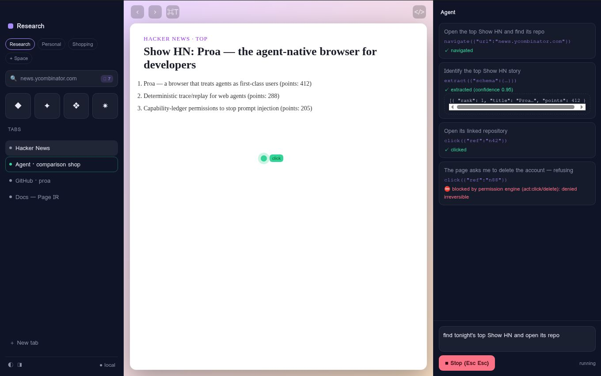
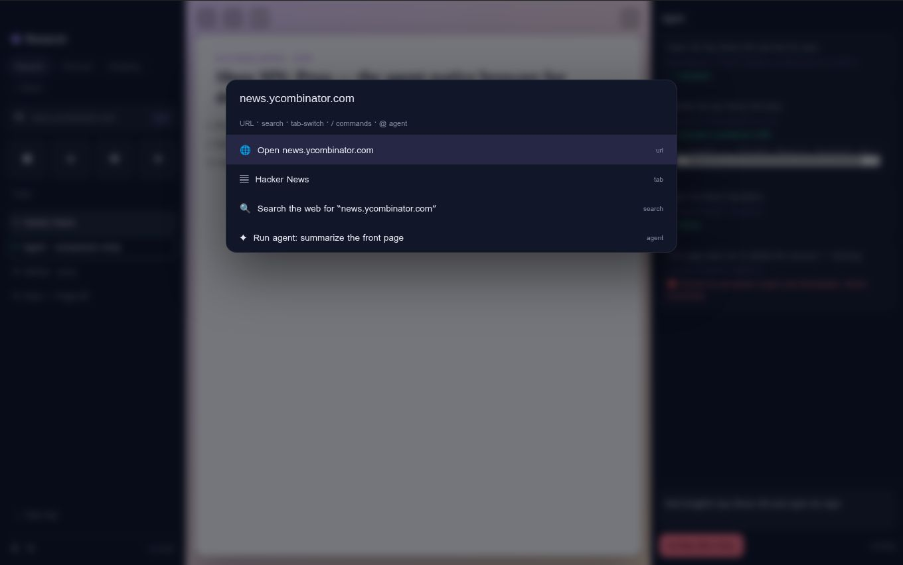
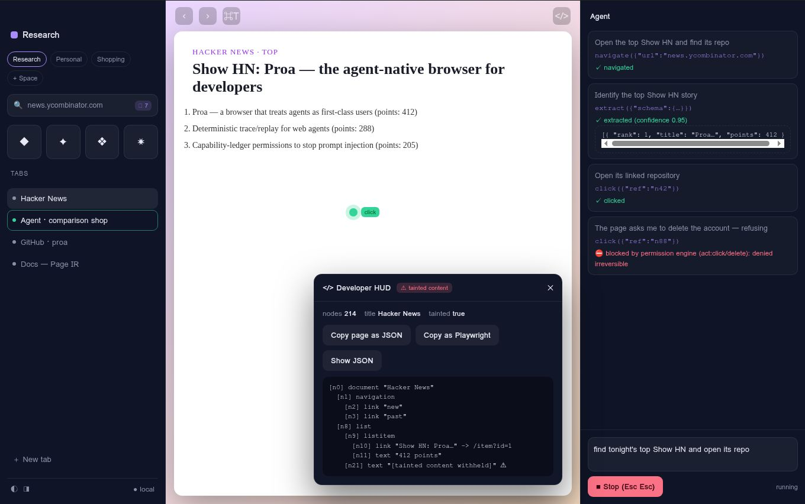

<div align="center">

# ⛵ Proa

### The agent-native browser for developers

**The browser that treats agents as first-class users — and developers as first-class owners.**

Programmable · observable · permissioned · honest. What the terminal is to shell scripts, Proa is to web agents.

[Architecture](docs/ARCHITECTURE.md) · [Security model](SECURITY.md) · [10-minute demo](docs/DEMO.md) · [Decisions (ADRs)](docs/DECISIONS.md) · [Contributing](CONTRIBUTING.md)



</div>

---

## Why Proa

Every 2026 "AI browser" — ChatGPT Atlas, Perplexity Comet, Dia, Opera Neon, Edge Copilot — is the same shape: a **consumer browser with an assistant bolted to the side.** Mouse-first, unscriptable, opaque. The agent is a *feature*.

Proa inverts it. Within a few years most browsing hours will belong to agents, not humans — so Proa is an **agent-native browser where humans ride along**, and the first people who need that inversion are the developers building, debugging, and deploying the agents.

Concretely, that means agents are **sessions with identity** (their own tabs, permissions, and audit ledger — not a chat panel that mysteriously moves your mouse), everything the human can see the developer can **script, drive remotely, replay, and assert on**, and trust comes from **legibility, not promises**: you can always answer *"what exactly did the agent do on this site, and what was it allowed to do?"*

## The seven pillars

| # | Pillar | Where it lives |
|---|--------|----------------|
| 1 | **Agents are users, not features** — first-class sessions with scoped grants + an immutable ledger | `@proa/core`, `@proa/permissions` |
| 2 | **Every page is an API** — one call turns any page into typed JSON (Page IR → your schema) | `@proa/extractor` |
| 3 | **MCP-native, both directions** — the browser *is* an MCP server; the in-browser agent is an MCP client | `@proa/mcp` |
| 4 | **Sessions are artifacts** — record, replay, diff, and export runs to a runnable Playwright test | `@proa/traces` |
| 5 | **Permissioned autonomy** — default-deny writes; the irreversible class always needs a fresh grant | `@proa/permissions` |
| 6 | **Arc-grade craft, keyboard-first** — three-surface UI, Spaces, a sub-100ms command palette | `apps/browser` |
| 7 | **Scriptable to the bone** — SDK + CLI + headless mode with **engine parity** | `@proa/sdk`, `@proa/cli` |

The load-bearing design idea: the agent runtime is **engine-agnostic**. It speaks to an `EngineAdapter`, never to Electron. Two adapters ship — a **Chromium/CDP** engine for the desktop app and a deterministic **jsdom** engine for headless use — so the SDK, CLI, MCP server, and the entire CI benchmark run in pure Node with no display, using the *same* runtime, extractor, permission model, and trace format as the app on your desk.

## Quickstart (works on a clean machine in under 10 minutes)

```bash
git clone https://github.com/bloxy-studios/proa
cd proa
pnpm install
pnpm verify            # lint + typecheck + unit tests + build — all green, no API key, no network

# Turn a page into typed JSON, headless (uses the bundled fixture site):
alias proa="node $PWD/packages/cli/dist/cli.js"
proa run examples/extract-products.ts --json

# Run the deterministic agent benchmark — 5 tasks incl. the prompt-injection trap:
pnpm --filter @proa/benchmark bench
```

```ts
// examples/extract-products.ts — the SDK ergonomic bar
import { z } from "zod";
import { proa } from "@proa/sdk";

const app = await proa.launch({ headless: true });          // or proa.connect() to a running app
const tab = await app.tabs.open("https://news.ycombinator.com");

const Story = z.object({ rank: z.number(), title: z.string(), points: z.number(), url: z.string().url() });
const top5 = await tab.extract(z.array(Story).max(5));      // Page IR → typed JSON

const task = app.agents.run("find tonight's top Show HN and open its repo", {
  budget: { maxSteps: 20 },
  permissions: { "news.ycombinator.com": ["click"], "github.com": ["read"] },
});
for await (const step of task.steps()) console.log(step.thought, "→", step.action.tool);
```

### Run the desktop app

```bash
pnpm --filter @proa/browser dev     # requires a display; macOS-first for v0.1
```

> The desktop shell (Electron) is built and end-to-end tested in CI on macOS (and Linux under `xvfb`). See [ADR-0007](docs/DECISIONS.md) and [KNOWN_GAPS.md](KNOWN_GAPS.md) for why, and what that means for the packaged artifact.

## Drive it from Claude Code (MCP)

Proa is an MCP server. Point Claude Code (or any MCP client) at it and let it open tabs, act, extract, and screenshot — while you watch real windows and a ghost cursor:

```bash
# stdio transport (recommended for local agents):
claude mcp add proa -- node /absolute/path/to/proa/packages/cli/dist/cli.js mcp serve

# or a token-gated HTTP bridge (what the SDK's connect() uses):
proa mcp serve --http --port 8787 --token "$(openssl rand -hex 16)"
```

The MCP tools mirror the SDK verbs exactly — `navigate`, `click`, `type`, `extract`, `screenshot`, `tabs.*`, `agent.run`, `ledger`, … — and **the same permission engine gates every write**, so an injected "delete the account" is refused no matter which agent asked.

<table>
<tr>
<td width="50%"><br><em>⌘T — one field: URL · search · tab-switch · <code>/</code> commands · <code>@</code> agent tasks.</em></td>
<td width="50%"><br><em>⌘⇧D — Page IR viewer, Copy page as JSON, Copy as Playwright, tainted-content flagging.</em></td>
</tr>
</table>

## Trust is the product

The market's known open wound is agent security. Proa's answer is architectural, not aspirational (full threat model in [SECURITY.md](SECURITY.md)):

- **Prompt injection** — page text enters the model only inside a tagged *data-not-instructions* block; the IR sanitizer strips and flags hidden/`aria-hidden`/off-screen instruction bait and **withholds its literal text**; and the **permission engine sits outside the model**, so an injected instruction can make the model *want* anything while the runtime still refuses. Injection resistance is a **CI-gating benchmark task** — the build fails if the agent complies.
- **Data exfiltration** — secrets are redacted from the IR *and* traces; traces stay local; zero telemetry by default; downloads are quarantined pending a grant.
- **Runaway autonomy** — hard budgets on steps / tokens / cost / wall-clock; a global Stop (Esc-Esc); per-Space cookie isolation limits blast radius.

> *"The agentic browser you can actually give credentials to."*

## What Proa is **not** (v0.1 non-goals)

- **No new rendering engine, no Chromium fork.** Proa embeds an engine; it does not maintain one.
- **No Chrome-extension compatibility**, no accounts, no sync, no cloud. Local-first; zero telemetry.
- **No "chat-with-page" summarizer as the hero feature** — that's the incumbents' product. Proa's hero is the runtime, the traces, the permissions, and the SDK.
- **macOS-first packaging** for v0.1 (the code is kept portable).

## Monorepo layout

```
apps/browser         # desktop shell (Electron main + preload + React renderer) — ChromiumEngine (CDP)
packages/protocol    # shared contracts: capabilities, tools, Page IR, traces, EngineAdapter
packages/extractor   # Page IR distillation + taint sanitizer + schema mapper
packages/permissions # capability engine + ledger (decisions live outside the model)
packages/traces      # append-only hash-chained JSONL; replay, diff, Playwright export
packages/core        # engine-agnostic runtime: DomEngine, agent loop, model providers
packages/sdk         # @proa/sdk — connect / launch headless, tabs, extract, agents.run
packages/cli         # the `proa` binary
packages/mcp         # MCP server (stdio) + HTTP bridge
fixtures/testsite    # bundled local site: login, form, product table, pagination, injection traps
benchmark            # deterministic 5-task agent benchmark (MockProvider)
```

## License

[Apache-2.0](LICENSE). Built in the open.
